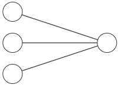
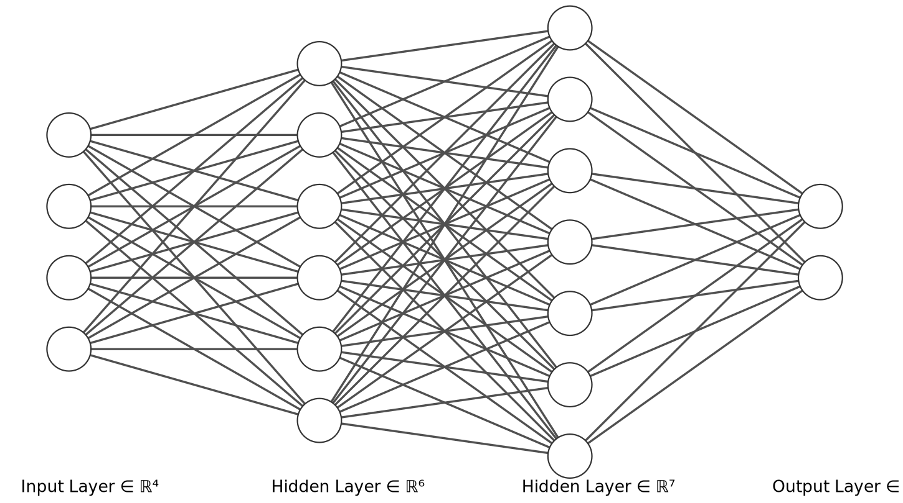
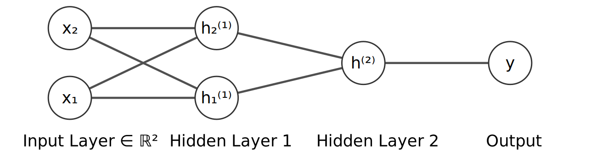
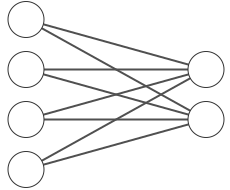

## Purpose

* I want to give you a crash course in Deep Learning with Julia
* We don't have the time to give a full overview of this huge field. 
* I recommend the interested reader to consult 
  * [http://statlearning.com/](http://statlearning.com/)
  * [https://bio322.epfl.ch/](https://bio322.epfl.ch/)
* Julia Tools:
  * [https://juliaml.ai](https://juliaml.ai)
  * [https://fluxml.ai](https://fluxml.ai)
  * [DataScienceTutorials.jl/](https://juliaai.github.io/DataScienceTutorials.jl/#!)


## What are Machine Learning (ML), AI and Deep Learning?

* ML is a branch of AI concerned with algo development.
* We want to generalise models to unseen data.
* AI wants to develop algos that do not need to be programmed - they *learn* how to improve themselves.
* Deep Learning is a form of an *Artificial Neural Network* with layers.

### (Deep) Neural Networks?

* Take a $p$ dimensional input vector $X$ and build a nonlinear function $f(X)$ to predict output $Y$.
* $f$ obeys a certain structure, which - **importantly** - allows automatic differentiation during optimization and parameter search.

## Taxonomy

1. supervised
2. unsupervised
3. RL

## Taxonomy details


## Taxonomy examples


## Deep learning - Artificial Neural Networks (ANN)

Components of an ANN:

1. Artificial Neurons: each neuron gets an input signal, processes it and outputs another signal (think: *one number in, one number out*)
2. Edges: connections between neurons (undirected, because can we want to go back and forwards)


::: {.callout-tip}
# Real Neurons

Real neurons in a human brain have many more ways of computing, calling this *neurons* is a stretch of imagination. Marketing.

:::


<!-- https://alexlenail.me/NN-SVG/ -->

## Example: A Single Layer ANN

* input $x$ (often a vector) which gets transformed to an 
* output $y$ (can also be a vector). We apply an *activation function* $\phi$ to a linear transformation of the input:


<table>
<tr>
<td style="vertical-align: middle;">
$$ x = 
\left(
\begin{align}
x_{1} \\
x_{2} \\
x_{3}
\end{align}
\right)
$$
</td>
<td>

</td>
<td style="vertical-align: middle;">
$$\begin{align} 
  z &= w'x + b \\  
  y &= \phi(z) 
  \end{align}
$$
</td>
</tr>
</table>

::: {.callout-note}
$w$ is a vector or weights, $b$ is an *intercept* or *bias* term. $\phi$ is (in general) a nonlinear function. This example has a 3-dim input and a 1-dim output, and a single layer (i.e. just the output layer).
:::


## Bias? Why Bias?

$$\begin{align} 
  z &= w'x + b \\  
  y &= \phi(z) 
  \end{align}
$$

* Well we know that $b$ is just the intercept. $z$ is nothing but a linear transformation.
* We economists call $z$ "a regression". The intercept shifts the line/hyperplane up and down, else it passes through the origin. 
* So, this *just* takes a linear transform of $x$ and sticks it into a nonlinear function $\phi$.


## What are those $\phi$ functions then?

* It's key that they are *nonlinear*.
* Typical choices are
  * *sigmoid*: $\phi(x) = \frac{1}{1 + \exp(-x)}$
  * ReLU (rectified linear unit): $\phi(x) = \begin{cases} 0 & \text{if } x<0\\x & \text{else.} \end{cases}$
* many others (*softmax*, *tanh*, *Leaky ReLU*, *GELU*,...)


## Deep Neural Networks (DNNs)

Single input layer, multiple hidden layers, single output layer




## DNNs



* Notice: each neuron towards the right depends on *entire* network left of it.
* $y$ depends on $h^{(2)}$, which depends on $h_1^{(1)}$ and $h_2^{(1)}$.


## DNNs


::: {.columns}
::: {.column}
$$\begin{align}
h_1^{(1)} &= \phi(w_{11}^{(1)} x_1 + w_{12}^{(1)} x_2 + b_1^{(1)}) \\
h_2^{(1)} &= \phi(w_{21}^{(1)} x_1 + w_{22}^{(1)} x_2 + b_2^{(1)})\\
h^{(2)} &= \phi(w_1^{(2)} h_1^{(1)} + w_2^{(2)} h_2^{(1)} + b^{(2)}) \\
y &= \phi(w^{(3)} h^{(2)} + b^{(3)})
\end{align}$$
:::
::: {.column}
* $w_{12}^{(1)}$ strength of $x_2 \rightarrow h_1^{(1)}$
* $\phi$ typically constant in layer
* $\phi$ can change across layers
:::
:::
<!-- end columns -->


::: {.notes}
example of calculations and how the input to each subsequent layer are all the outputs of the preceding layer
:::

# Example: Hand Written Digit Recognition

## Simplest Problem: Detect `/` vs `\`

<br>

::: {.columns width="45%"}
::: {.column}
* Suppose we have 4 pixels of data, arranged as a square
* Each pixel can be white (*on*, `1`) or black (*off*, `0`).
:::
::: {.column width="5%"}
:::
::: {.column width="45%"}
<svg width="200" height="200">
  <rect width="200" height="200" style="fill:black;" />
  <rect x="0" y="0" width="100" height="100" style="fill:black;stroke:gray;stroke-width:3px;"/>
  <rect x="100" y="0" width="100" height="100" style="fill:white;stroke:gray;stroke-width:3px;"/>
  <rect x="0" y="100" width="100" height="100" style="fill:white;stroke:gray;stroke-width:3px;"/>
  <rect x="100" y="100" width="100" height="100" style="fill:black;stroke:gray;stroke-width:3px;"/>
</svg>
:::
:::
<!-- end columns -->

::: {.fragment}

* Imagine this is a *very* low quality digital photograph of somebody's handwritten `/`
* like, 4 pixels of information only. 
* You can see why we chose `/` for this exercise, any other digit is too complex for this. More on that later.
:::


## Simplest Problem: Detect `/` vs `\`

<br>

::: {.columns width="45%"}
::: {.column}
* Suppose we have 4 pixels of data, arranged as a square
* Each pixel can be white (*on*, `1`) or black (*off*, `0`).
:::
::: {.column width="5%"}
:::
::: {.column width="45%"}
<svg width="200" height="200">
  <rect width="200" height="200" style="fill:black;" />
  <rect x="0" y="0" width="100" height="100" style="fill:black;stroke:gray;stroke-width:3px;"/>
  <rect x="100" y="0" width="100" height="100" style="fill:white;stroke:gray;stroke-width:3px;"/>
  <rect x="0" y="100" width="100" height="100" style="fill:white;stroke:gray;stroke-width:3px;"/>
  <rect x="100" y="100" width="100" height="100" style="fill:black;stroke:gray;stroke-width:3px;"/>
</svg>
:::
:::
<!-- end columns -->


::: {.columns width="45%"}
::: {.column}
*  We want to *recognize* from those a *white* forward slash
*  or *white* backward slash
*  Those represent *handwriting* in this example.
:::
::: {.column width="5%"}
:::
::: {.column width="45%"}
<svg width="200" height="200">
  <rect width="200" height="200" style="fill:black;" />
  <text  x="100" y="175" font-size="200" text-anchor="middle"  style="fill:white;stroke:white;">⟋</text>
</svg>
:::
:::


## 

<table style="table-layout: fixed!important;width:700px;">
<tr style="border: 0;border-style:hidden;">
<td style="vertical-align: middle;padding:0;width:200px!important;">
<svg width="200" height="200">
  <rect width="200" height="200" style="fill:black;" />
  <rect x="0" y="0" width="100" height="100" style="fill:black;stroke:gray;stroke-width:3px;"/>
  <rect x="100" y="0" width="100" height="100" style="fill:white;stroke:gray;stroke-width:3px;"/>
  <rect x="0" y="100" width="100" height="100" style="fill:white;stroke:gray;stroke-width:3px;"/>
  <rect x="100" y="100" width="100" height="100" style="fill:black;stroke:gray;stroke-width:3px;"/>
</svg>
</td>
<td style="vertical-align: middle;padding:0;width:300px!important;">
<i class="fas fa-arrow-right" style="font-size:100px;padding:100px;"></i>
</td>
<td style="vertical-align: middle;padding:0;padding:0;width:200px!important;">
<svg width="200" height="200">
  <rect width="200" height="200" style="fill:black;" />
  <text  x="100" y="175" font-size="200" text-anchor="middle"  style="fill:white;stroke:white;">⟋</text>
</svg>
</td>
</tr>
<tr style="border: 0;border-style:hidden;">
<td style="vertical-align: middle;padding:0;width:200px!important;">
<svg width="200" height="200">
  <rect width="200" height="200" style="fill:black;" />
  <rect x="0" y="0" width="100" height="100" style="fill:white;stroke:gray;stroke-width:3px;"/>
  <rect x="100" y="0" width="100" height="100" style="fill:black;stroke:gray;stroke-width:3px;"/>
  <rect x="0" y="100" width="100" height="100" style="fill:black;stroke:gray;stroke-width:3px;"/>
  <rect x="100" y="100" width="100" height="100" style="fill:white;stroke:gray;stroke-width:3px;"/>
</svg>
</td>
<td style="vertical-align: middle;padding:0;width:300px!important;">
<i class="fas fa-arrow-right" style="font-size:100px;padding:100px;"></i>
</td>
<td style="vertical-align: middle;padding:0;padding:0;width:200px!important;">
<svg width="200" height="200">
  <rect width="200" height="200" style="fill:black;" />
  <text  x="100" y="175" font-size="200" text-anchor="middle"  style="fill:white;stroke:white;">⟍</text>
</svg>
</td>
</tr>
</table>


## Simplest Problem: Detect `/` vs `\`


### How does supervised learning work with NNs?

* We provide the algo with *pairs* of values: input, output $(X,Y)$
* We *train* it on those pairs.
* Then we give it a new $X$ and want a new $Y$ back.

::: {.fragment}
* For *regression tasks* that's ok. Vector $x$ in, number $y$ out.
* But *classification* (is this picture `/` or `\`?) needs a tweak.
:::

::: {.fragment}
We need to *encode* classes (`/` or `\`) into numbers somehow.
:::


## Simplest Problem: Detect `/` vs `\`


### Input Encoding

Let's go down column-wise in each box of squares and record `0` for black and `1` for white. Each square is $x_1,\dots,x_4 \in \{0,1\}$

<table style="table-layout: fixed!important;width:700px;">
<tr style="border: 0;border-style:hidden;">
<td style="vertical-align: middle;padding:0;width:200px!important;">
<svg width="200" height="200">
  <rect width="200" height="200" style="fill:black;" />
  <rect x="0" y="0" width="100" height="100" style="fill:black;stroke:gray;stroke-width:3px;"/>
  <rect x="100" y="0" width="100" height="100" style="fill:white;stroke:gray;stroke-width:3px;"/>
  <rect x="0" y="100" width="100" height="100" style="fill:white;stroke:gray;stroke-width:3px;"/>
  <rect x="100" y="100" width="100" height="100" style="fill:black;stroke:gray;stroke-width:3px;"/>
</svg>
</td>
<td style="vertical-align: middle;padding:0;font-size:100px;width:200px!important;">
<i style="padding:100px;">  </i>
</td>
<td style="vertical-align: middle;padding-bottom:50px;:0;font-size:100px;width:400px!important;">
(0,1,1,0)
</td>
</tr>
<tr style="border: 0;border-style:hidden;padding-bottom:100px">
<td style="vertical-align: middle;padding:0;width:200px!important;"></td>
</tr >

<tr style="border: 0;border-style:hidden;">
<td style="vertical-align: middle;padding:0;width:200px!important;">
<svg width="200" height="200">
  <rect width="200" height="200" style="fill:black;" />
  <rect x="0" y="0" width="100" height="100" style="fill:white;stroke:gray;stroke-width:3px;"/>
  <rect x="100" y="0" width="100" height="100" style="fill:black;stroke:gray;stroke-width:3px;"/>
  <rect x="0" y="100" width="100" height="100" style="fill:black;stroke:gray;stroke-width:3px;"/>
  <rect x="100" y="100" width="100" height="100" style="fill:white;stroke:gray;stroke-width:3px;"/>
</svg>
</td>
<td style="vertical-align: middle;padding:0;font-size:100px;width:200px!important;">
<i style="padding:100px;">  </i>
</td>
<td style="vertical-align: middle;padding-bottom:50px;:0;font-size:100px;width:400px!important;">
(1,0,0,1)
</td>
</tr>
</table>


## Simplest Problem: Detect `/` vs `\`

### Output encoding

Same for output $Y$. We use a **one-hot encoding** with a 2-dimensional vector $(y_{1}, y_{2})$.

<br>

::: {.callout-tip}
# One hot encoding vs dummy variables

* Dummy vars typically have a reference category. For K levels you need K-1 columns. Like `red,green,blue` is K=3.
* One-hot encodes *all* categories.
:::


## Simplest Problem: Detect `/` vs `\`

### Output encoding

Same for output $Y$. We use a **one-hot encoding** with a 2-dimensional vector $(y_{1}, y_{2})$.


::: {.columns}
::: {.column}

**Dummy Variables**

```R
green blue
  0     0
  1     0
  0     1
  0     0
  0     1

```

:::
::: {.column}

**One-hot Encoding**

```R
red green blue
 1    0     0
 0    1     0
 0    0     1
 1    0     0
 0    0     1
```
:::
:::


## Simplest Problem: Detect `/` vs `\`


### Output encoding: One-hot

Let's go with the following. You can see that this is arbitrary (we could easily have inverted this without consequences.)

<table style="table-layout: fixed!important;width:700px;">
<tr style="border: 0;border-style:hidden;">
<td style="vertical-align: middle;padding:0;width:200px!important;">
<svg width="200" height="200">
  <rect width="200" height="200" style="fill:black;" />
  <text  x="100" y="175" font-size="200" text-anchor="middle"  style="fill:white;stroke:white;">⟋</text>
</svg>
</td>
<td style="vertical-align: middle;padding:0;font-size:100px;width:200px!important;">
<i style="padding:100px;">  </i>
</td>
<td style="vertical-align: middle;padding-bottom:50px;:0;font-size:100px;width:300px!important;">
(1,0) 
</td>
</tr>
<tr style="border: 0;border-style:hidden;">
<td style="vertical-align: middle;padding:0;width:200px!important;">
<svg width="200" height="200">
  <rect width="200" height="200" style="fill:black;" />
  <text  x="100" y="175" font-size="200" text-anchor="middle"  style="fill:white;stroke:white;">⟍</text>
</svg>
</td>
<td style="vertical-align: middle;padding:0;font-size:100px;width:200px!important;">
<i style="padding:100px;">  </i>
</td>
<td style="vertical-align: middle;padding-bottom:50px;:0;font-size:100px;width:300px!important;">
(0,1) 
</td>
</tr>
</table>

## Simplest Problem: Detect `/` vs `\`

<table>
<tr>
<td style="vertical-align: middle;">
$$ x = 
\left(
\begin{align}
x_{1} \\
x_{2} \\
x_{3} \\
x_{4}
\end{align}
\right)
$$
</td>
<td>


</td>
<td style="vertical-align: middle;">
$$\left( 
  \begin{align} 
  y_{1} \\  
  y_{2} 
  \end{align} \right) = 
  y$$
</td>
</tr>
</table>


::: {.callout-tip}
# Computing parameters
We need $y = \phi(z)$ and $z=Wx + b$.

1. $W$ is a $(2,4)$ matrix of weights
2. $b$ is a $(2,1)$ vector of biases
:::


## Simplest Problem: Detect `/` vs `\`

### Linear Activation Function (for Teaching only)

* Let's assume that $\phi(x)=x$ so we can compute the coefficients.
  
$$y = \phi(Wx + b) = Wx + b$$

* Which, written out is


$$\left( \begin{array}{c} y_{1} \\ y_{2}  \end{array} \right) = \left( \begin{array}{cccc} w_{1,1} & w_{1,2} & w_{1,3} & w_{1,4} \\ w_{2,1} & w_{2,2} & w_{2,3} & w_{2,4}  \end{array} \right) \left( \begin{array}{c} x_{1} \\ x_{2} \\ x_{3} \\ x_{4} \end{array} \right) + \left( \begin{array}{c} b_{1} \\ b_{2}  \end{array} \right)$$


## 

There are 2 relevant cases, and we need to find values for $W$ and $b$ such that a certain tuple of x values results in a certain y output.

$$\left( \begin{array}{cccc} w_{1,1} & w_{1,2} & w_{1,3} & w_{1,4} \\ w_{2,1} & w_{2,2} & w_{2,3} & w_{2,4}  \end{array} \right) \left( \begin{array}{c} 0 \\ 1\\ 1\\ 0 \end{array} \right) + \left( \begin{array}{c} b_{1} \\ b_{2}  \end{array} \right) = \left( \begin{array}{c} 1 \\ 0  \end{array} \right)$$

$$\left( \begin{array}{cccc} w_{1,1} & w_{1,2} & w_{1,3} & w_{1,4} \\ w_{2,1} & w_{2,2} & w_{2,3} & w_{2,4}  \end{array} \right) \left( \begin{array}{c} 1 \\ 0\\ 0\\ 1 \end{array} \right) + \left( \begin{array}{c} b_{1} \\ b_{2}  \end{array} \right) = \left( \begin{array}{c} 0 \\ 1  \end{array} \right)$$

## {transition="fade" transition-speed="slow"}


There are 2 relevant cases, and we need to find values for $W$ and $b$ such that a certain tuple of x values results in a certain y output.

$$\left( \begin{array}{c} w_{1,2} + w_{1,3}  \\ w_{2,2} + w_{2,3}   \end{array} \right) + \left( \begin{array}{c} b_{1} \\ b_{2}  \end{array} \right) = \left( \begin{array}{c} 1 \\ 0  \end{array} \right)$$

$$\left( \begin{array}{c} w_{1,1} + w_{1,4}  \\ w_{2,1} + w_{2,4}   \end{array} \right) + \left( \begin{array}{c} b_{1} \\ b_{2}  \end{array} \right) = \left( \begin{array}{c} 1 \\ 0  \end{array} \right)$$

## {transition="fade" transition-speed="slow"}


There are 2 relevant cases, and we need to find values for $W$ and $b$ such that a certain tuple of x values results in a certain y output.

$$\begin{aligned}
w_{1,2} + w_{1,3} + b_{1} &= 1 \\
w_{2,2} + w_{2,3} + b_{2} &= 0 \\
w_{1,1} + w_{1,4} + b_{1} &= 1 \\
w_{2,1} + w_{2,4} + b_{2} &= 0
\end{aligned}$$

If we can find values $W$ and $b$ such that this holds, our NN will perfectly recognize `/` and `\`.

::: {.callout-note}
Solving 4 equations with 10 variables: we have 6 degrees of freedom too many. Can just choose an arbitrary number for those and solve system for the remaining four.
:::

## Computed weights and biases

I set $b=0$ and $w_{11},w_{12},w_{21},w_{23}=0.5$. This gives

$$\left( \begin{array}{cccc} 0.5 & 0.5 & 0.5 & -0.5 \\ 0.5 & 0.5 & -0.5 & 0.5  \end{array} \right) \left( \begin{array}{c} 0 \\ 1\\ 1\\ 0 \end{array} \right) + \left( \begin{array}{c} 0 \\ 0  \end{array} \right) = \left( \begin{array}{c} 1 \\ 0  \end{array} \right)$$

$$\left( \begin{array}{cccc} 0.5 & 0.5 & 0.5 & -0.5 \\ 0.5 & 0.5 & -0.5 & 0.5 \end{array} \right) \left( \begin{array}{c} 1 \\ 0\\ 0\\ 1 \end{array} \right) + \left( \begin{array}{c} 0 \\ 0  \end{array} \right) = \left( \begin{array}{c} 0 \\ 1  \end{array} \right)$$


## Simplest Problem: Detect `/` vs `\`

<br>

* A *very* simple NN with a linear activation function was perfectly able to recognize those characters from colored (black or white) pixels
* 4 input neurons 
* 2 output neurons

::: {.fragment}
* Increasing pixels: increasing resolution of the image
* more variables to deal with, and nonlinear activations: cannot solve by hand.
:::


## Demo Setup

```{julia}
#| echo: true
function demo(x=nothing)
    println("Simple Neural Network Demo")
    println("="^40)
    if x === nothing
        x = rand(4)
    elseif !(isa(x, Vector{<:Real}) && length(x) == 4)
        error("Input 'x' must be a vector of 4 real numbers")
    end
    
    # Input
    # Weights and biases
    W = [0.5  0.5  0.5 -0.5;
         0.5  0.5 -0.5  0.5]
    b = [0, 0]
    
    # Output    
    y = W * x + b
    
    println("Input:")
    println("┌─────┬─────┐")
    println("│ $(round(x[1], digits=1)) │ $(round(x[2], digits=1)) │")
    println("├─────┼─────┤")
    println("│ $(round(x[3], digits=1)) │ $(round(x[4], digits=1)) │")
    println("└─────┴─────┘")
    
    # simple rule: (1,0) means `/`
    # so let's say any (q,r) means `/` as long as q > r
    println("Output:")
    if y[1] >= y[2]
        println("┌───┐")
        println("│ ⟋ │")
        println("└───┘")
    end
    if y[1] ≈ y[2]
        println("or")
    end
    if y[2] >= y[1]
        println("┌───┐")
        println("│ ⟍ │")
        println("└───┘")
    end
    
    return y
end
```

## Run Demo

<br>

```{julia}
#| echo: true
demo([0,1,1,0])  # should give `/`
```

## Run Demo

<br>

```{julia}
#| echo: true
demo([1,0,0,1])  # should give `\`
```

## Run Demo on *unseen* data

How does this NN generalize to *test* data?

<br>

```{julia}
#| echo: true
demo([0.5,0.1,0.2,0.4])  # square with shades of grey
```


# 5×5 Pixel Digit Recognition

## Scaling Up: From 4 to 25 Pixels

::: {.columns}
::: {.column}
**What we had:**

* 4-pixel grid, 2 classes (`/` vs `\`)
* 10 unknowns, 4 equations → solved analytically
:::
::: {.column}
**What we want now:**

* **25 pixels** (5×5 grid), **10 classes** (digits 0–9)
* 260 parameters, 300 equations → overdetermined
* Cannot solve exactly — must **minimize error**
:::
:::

::: {.fragment}
**Solution:** Gradient descent — find $W$, $b$ that minimize average squared error.
:::


## 5×5 Pixel Digits

Three hand-crafted variants (a, b, c) for each digit:

```{julia}
#| echo: false
#| fig-align: center
using Plots
using LinearAlgebra

# Pixel data: 30 × 25 matrix. Each row = one digit, pixels read row-by-row from the 5×5 grid.
const PIXELS = Float64[
    # ——— variant a ———
    1 1 1 1 1 1 0 0 0 1 1 0 0 0 1 1 0 0 0 1 1 1 1 1 1;
    0 0 1 0 0 0 1 1 0 0 0 0 1 0 0 0 0 1 0 0 0 0 1 0 0;
    1 1 1 1 0 0 0 0 0 1 0 1 1 1 0 1 0 0 0 0 1 1 1 1 1;
    1 1 1 1 1 0 0 0 0 1 0 1 1 1 0 0 0 0 0 1 1 1 1 1 1;
    0 0 1 1 0 0 1 0 1 0 1 0 0 1 0 1 1 1 1 1 0 0 0 1 0;
    1 1 1 1 1 1 0 0 0 0 1 1 1 1 0 0 0 0 0 1 1 1 1 1 0;
    1 1 1 1 1 1 0 0 0 0 1 1 1 1 1 1 0 0 0 1 1 1 1 1 1;
    1 1 1 1 1 0 0 0 0 1 0 0 0 1 0 0 0 1 0 0 0 0 1 0 0;
    1 1 1 1 1 1 0 0 0 1 1 1 1 1 1 1 0 0 0 1 1 1 1 1 1;
    1 1 1 1 1 1 0 0 0 1 1 1 1 1 1 0 0 0 0 1 1 1 1 1 1;
    # ——— variant b ———
    1 1 1 1 0 1 0 0 1 0 1 0 0 1 0 1 0 0 1 0 1 1 1 1 0;
    0 1 0 0 0 1 1 0 0 0 0 1 0 0 0 0 1 0 0 0 0 1 0 0 0;
    1 1 1 0 0 0 0 0 1 0 0 1 1 0 0 1 0 0 0 0 1 1 1 1 0;
    1 1 1 1 0 0 0 0 1 0 0 1 1 0 0 0 0 0 1 0 1 1 1 1 0;
    0 1 1 0 0 1 0 1 0 0 1 0 1 0 0 1 1 1 1 0 0 0 1 0 0;
    1 1 1 1 0 1 0 0 0 0 1 1 1 0 0 0 0 0 1 0 1 1 1 0 0;
    1 1 1 1 0 1 0 0 0 0 1 1 1 1 0 1 0 0 1 0 1 1 1 1 0;
    1 1 1 1 0 0 0 0 1 0 0 0 1 0 0 0 1 0 0 0 0 1 0 0 0;
    1 1 1 1 0 1 0 0 1 0 1 1 1 1 0 1 0 0 1 0 1 1 1 1 0;
    1 1 1 1 0 1 0 0 1 0 1 1 1 1 0 0 0 0 1 0 1 1 1 1 0;
    # ——— variant c ———
    0 1 1 1 1 0 1 0 0 1 0 1 0 0 1 0 1 0 0 1 0 1 1 1 1;
    0 0 0 1 0 0 0 1 1 0 0 0 0 1 0 0 0 0 1 0 0 0 0 1 0;
    0 1 1 1 0 0 0 0 0 1 0 0 1 1 0 0 1 0 0 0 0 1 1 1 1;
    0 1 1 1 1 0 0 0 0 1 0 0 1 1 0 0 0 0 0 1 0 1 1 1 1;
    0 0 1 1 0 0 1 0 1 0 0 1 0 1 0 0 1 1 1 1 0 0 0 1 0;
    0 1 1 1 1 0 1 0 0 0 0 1 1 1 0 0 0 0 0 1 0 1 1 1 0;
    0 1 1 1 1 0 1 0 0 0 0 1 1 1 1 0 1 0 0 1 0 1 1 1 1;
    0 1 1 1 1 0 0 0 0 1 0 0 0 1 0 0 0 1 0 0 0 0 1 0 0;
    0 1 1 1 1 0 1 0 0 1 0 1 1 1 1 0 1 0 0 1 0 1 1 1 1;
    0 1 1 1 1 0 1 0 0 1 0 1 1 1 1 0 0 0 0 1 0 1 1 1 1;
]
const LABELS = [0,1,2,3,4,5,6,7,8,9, 0,1,2,3,4,5,6,7,8,9, 0,1,2,3,4,5,6,7,8,9]

plts = []
for i in 1:30
    grid = reshape(PIXELS[i,:], 5, 5)'  # transpose: Julia reshape is column-major
    p = heatmap(grid,
        color=:grays, clim=(0,1),
        aspect_ratio=1, axis=false, ticks=false,
        colorbar=false,
        title=string(LABELS[i]),
        titlefontsize=10,
        yflip=true,
        framestyle=:none)
    push!(plts, p)
end
plot(plts..., layout=(3, 10), size=(700, 240))
```


## Input Encoding

Each 5×5 grid is read **row by row** into $x = (x_1, \ldots, x_{25}) \in \{0,1\}^{25}$:

<table style="table-layout: fixed!important;width:700px;">
<tr style="border: 0;border-style:hidden;">
<td style="vertical-align: middle;padding:10px;">
<svg xmlns="http://www.w3.org/2000/svg" viewBox="0 0 100 100" width="120" height="120">
<rect x="0"  y="0"  width="20" height="20" fill="black" stroke="gray" stroke-width="1"/>
<rect x="20" y="0"  width="20" height="20" fill="black" stroke="gray" stroke-width="1"/>
<rect x="40" y="0"  width="20" height="20" fill="white" stroke="gray" stroke-width="1"/>
<rect x="60" y="0"  width="20" height="20" fill="black" stroke="gray" stroke-width="1"/>
<rect x="80" y="0"  width="20" height="20" fill="black" stroke="gray" stroke-width="1"/>
<rect x="0"  y="20" width="20" height="20" fill="black" stroke="gray" stroke-width="1"/>
<rect x="20" y="20" width="20" height="20" fill="white" stroke="gray" stroke-width="1"/>
<rect x="40" y="20" width="20" height="20" fill="white" stroke="gray" stroke-width="1"/>
<rect x="60" y="20" width="20" height="20" fill="black" stroke="gray" stroke-width="1"/>
<rect x="80" y="20" width="20" height="20" fill="black" stroke="gray" stroke-width="1"/>
<rect x="0"  y="40" width="20" height="20" fill="black" stroke="gray" stroke-width="1"/>
<rect x="20" y="40" width="20" height="20" fill="black" stroke="gray" stroke-width="1"/>
<rect x="40" y="40" width="20" height="20" fill="white" stroke="gray" stroke-width="1"/>
<rect x="60" y="40" width="20" height="20" fill="black" stroke="gray" stroke-width="1"/>
<rect x="80" y="40" width="20" height="20" fill="black" stroke="gray" stroke-width="1"/>
<rect x="0"  y="60" width="20" height="20" fill="black" stroke="gray" stroke-width="1"/>
<rect x="20" y="60" width="20" height="20" fill="black" stroke="gray" stroke-width="1"/>
<rect x="40" y="60" width="20" height="20" fill="white" stroke="gray" stroke-width="1"/>
<rect x="60" y="60" width="20" height="20" fill="black" stroke="gray" stroke-width="1"/>
<rect x="80" y="60" width="20" height="20" fill="black" stroke="gray" stroke-width="1"/>
<rect x="0"  y="80" width="20" height="20" fill="black" stroke="gray" stroke-width="1"/>
<rect x="20" y="80" width="20" height="20" fill="black" stroke="gray" stroke-width="1"/>
<rect x="40" y="80" width="20" height="20" fill="white" stroke="gray" stroke-width="1"/>
<rect x="60" y="80" width="20" height="20" fill="black" stroke="gray" stroke-width="1"/>
<rect x="80" y="80" width="20" height="20" fill="black" stroke="gray" stroke-width="1"/>
</svg>
</td>
<td style="vertical-align: middle;padding:0;font-size:50px;width:150px!important;">
<i style="padding:30px;">  </i>
</td>
<td style="vertical-align: middle;font-size:70%;">
$$\begin{align}
( & 0,0,1,0,0, \\
  & 0,1,1,0,0, \\
  & 0,0,1,0,0, \\
  & 0,0,1,0,0, \\
  & 0,0,1,0,0 )
\end{align}$$
</td>
</tr>
</table>


## Output Encoding

10 classes → **one-hot encoding** $y = (y_0, y_1, \ldots, y_9) \in \{0,1\}^{10}$

<table style="table-layout: fixed!important;width:700px;">
<tr style="border: 0;border-style:hidden;">
<td style="vertical-align: middle;padding:0;width:150px!important;">
<svg width="120" height="120">
  <rect width="120" height="120" style="fill:black;" />
  <text x="60" y="100" font-size="120" text-anchor="middle" style="fill:white;stroke:white;">1</text>
</svg>
</td>
<td style="vertical-align: middle;padding:0;font-size:50px;width:150px!important;">
<i style="padding:30px;">  </i>
</td>
<td style="vertical-align: middle;font-size:70%;">
$(0,1,0,0,0,0,0,0,0,0)$
</td>
</tr>
<tr style="border: 0;border-style:hidden;">
<td style="vertical-align: middle;padding:0;width:150px!important;">
<svg width="120" height="120">
  <rect width="120" height="120" style="fill:black;" />
  <text x="60" y="100" font-size="120" text-anchor="middle" style="fill:white;stroke:white;">7</text>
</svg>
</td>
<td style="vertical-align: middle;padding:0;font-size:50px;width:150px!important;">
<i style="padding:30px;">  </i>
</td>
<td style="vertical-align: middle;font-size:70%;">
$(0,0,0,0,0,0,0,1,0,0)$
</td>
</tr>
</table>


## Network Parameters

$$\hat{y} = Wx + b$$

| | Size | Count |
|--|--|--|
| $W$ | $10 \times 25$ | 250 weights |
| $b$ | $10 \times 1$ | 10 biases |
| **Total** | | **260 parameters** |

::: {.fragment}
With **30 training samples**: $30 \times 10 = 300$ equations for 260 unknowns

→ **overdetermined**: no exact solution in general → minimize error
:::


## Loss Function

For one training pair $(x, y)$ the **sample loss** is:

$$\mathcal{L}_{(x,y)}(W,b) = \sum_{i=0}^{9} \big(\hat{y}_i - y_i\big)^2 = \sum_{i=0}^{9} \bigg(\sum_{j=1}^{25} w_{ij}\, x_j + b_i - y_i\bigg)^2$$

The **average loss** over the full training set $S$ is:

$$\mathcal{L}(W,b) = \frac{1}{|S|} \sum_{(x,y) \in S} \mathcal{L}_{(x,y)}(W,b)$$

::: {.callout-note}
We want to find $W$, $b$ that minimize $\mathcal{L}(W,b)$.
:::


## Gradients

The gradient tells us the direction of **steepest ascent** of the loss. Moving **opposite** to it reduces the loss.

**For weights** $w_{ij}$:

$$\frac{\partial \mathcal{L}_{(x,y)}}{\partial w_{ij}} = \frac{\partial \mathcal{L}}{\partial \hat{y}_i} \cdot \frac{\partial \hat{y}_i}{\partial w_{ij}} = 2(\hat{y}_i - y_i) \cdot x_j$$

**For biases** $b_i$:

$$\frac{\partial \mathcal{L}_{(x,y)}}{\partial b_i} = \frac{\partial \mathcal{L}}{\partial \hat{y}_i} \cdot \frac{\partial \hat{y}_i}{\partial b_i} = 2(\hat{y}_i - y_i) \cdot 1$$

::: {.callout-tip}
In matrix form with $\delta = 2(\hat{y} - y)$: $\quad \nabla_W \mathcal{L} = \delta\, x^\top \quad$ and $\quad \nabla_b \mathcal{L} = \delta$
:::


## Julia: Training Data Setup

```{julia}
#| echo: true
function one_hot(digit::Int)
    y = zeros(Float64, 10)
    y[digit + 1] = 1.0   # digit 0 → index 1, ..., digit 9 → index 10
    return y
end

X_train = [PIXELS[i, :] for i in 1:30]        # 30 input vectors, each length 25
Y_train = [one_hot(LABELS[i]) for i in 1:30]  # 30 one-hot output vectors, each length 10
```


## Julia: Predict and Loss

```{julia}
#| echo: true
predict(W, b, x) = W * x + b             # forward pass: 10-dim output

sample_loss(ŷ, y) = sum((ŷ .- y).^2)    # sum of squared errors for one sample
```


## Julia: Gradients

```{julia}
#| echo: true
function sample_gradients(W, b, x, y)
    ŷ = predict(W, b, x)
    δ = 2.0 .* (ŷ .- y)    # ∂L/∂ŷ  (10-vector)
    ∇W = δ * x'             # ∂L/∂W  (10×25 outer product)
    ∇b = δ                  # ∂L/∂b  (10-vector)
    return ∇W, ∇b
end
```


## Julia: Gradient Descent

```{julia}
#| echo: true
function gradient_descent(X, Y; η=0.1, tol=5e-3, maxiter=10_000)
    W = randn(10, 25) .* 0.1
    b = zeros(Float64, 10)
    losses = Float64[]
    for iter in 1:maxiter
        ∇W = zeros(10, 25); ∇b = zeros(10); L = 0.0
        for (x, y) in zip(X, Y)
            gW, gb = sample_gradients(W, b, x, y)
            ∇W .+= gW;  ∇b .+= gb
            L  += sample_loss(predict(W, b, x), y)
        end
        ∇W ./= length(X);  ∇b ./= length(X);  L /= length(X)
        push!(losses, L)
        gnorm = norm(vcat(vec(∇W), ∇b))
        if iter % 2000 == 0
            println("iter $iter: loss=$(round(L,digits=4))  ‖∇‖=$(round(gnorm,digits=4))")
        end
        if gnorm < tol
            println("Converged at iteration $iter  (loss=$(round(L,digits=5)))")
            break
        end
        W .-= η .* ∇W;  b .-= η .* ∇b
    end
    return W, b, losses
end
```


## Training

```{julia}
#| echo: true
using Random
Random.seed!(42)
W_opt, b_opt, loss_history = gradient_descent(X_train, Y_train)
```


## Loss over Iterations

```{julia}
#| echo: false
#| fig-align: center
plot(loss_history,
    xlabel = "Iteration",
    ylabel = "Average Loss",
    title  = "Gradient Descent Convergence",
    legend = false,
    lw = 2,
    color  = :steelblue,
    size   = (650, 350))
```


## Training Accuracy

```{julia}
#| echo: true
function classify(W, b, x)
    scores = predict(W, b, x)
    return argmax(scores) - 1   # convert 1-indexed back to digit label
end

correct = sum(classify(W_opt, b_opt, x) == LABELS[i] for (i, x) in enumerate(X_train))
println("Training accuracy: $correct / $(length(X_train)) = $(round(100correct/length(X_train), digits=1))%")
```


## Learned Weights

Each row of $W$ is a 25-dim vector: visualised as a 5×5 "template" for each digit.

```{julia}
#| echo: false
#| fig-align: center
wplts = []
for d in 0:9
    w = reshape(W_opt[d+1, :], 5, 5)'  # transpose: Julia reshape is column-major
    p = heatmap(w,
        color=:RdBu, aspect_ratio=1,
        axis=false, ticks=false,
        colorbar=false,
        title="digit $d",
        titlefontsize=9,
        yflip=true,
        framestyle=:none)
    push!(wplts, p)
end
plot(wplts..., layout=(2, 5), size=(650, 280))
```
